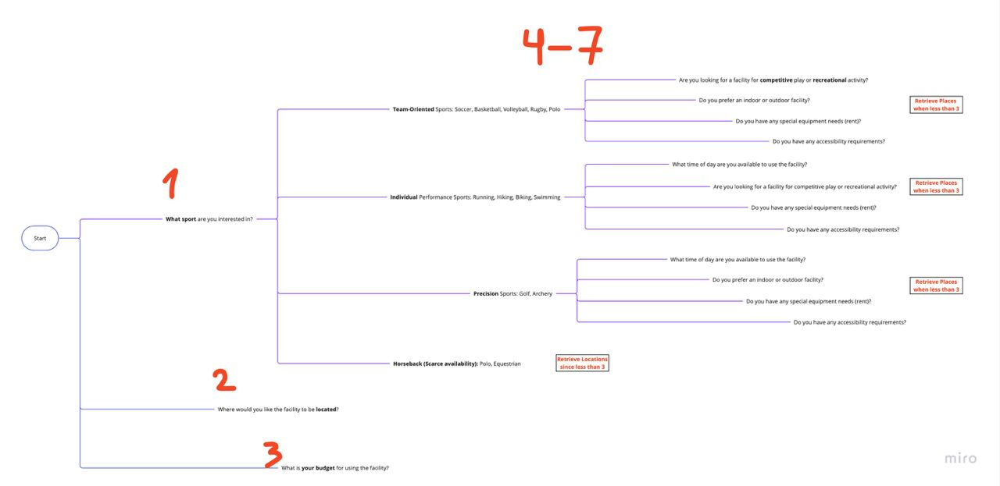

# README for Sports Facility Recommendation Expert System

## Description
This Expert System is designed to recommend sports facilities based on user preferences. It utilizes Python and PyQt5 for the user interface and Prolog for the logical decision-making backend. The system takes user input in natural language, processes it to extract information, and then queries a Prolog knowledge base to find suitable sports facilities.

## Environment Setup and Installation
To run this application, you'll need Python and Prolog installed on your system along with the necessary Python packages.

### Python Setup
1. Ensure Python is installed on your system. Python 3.6 or later is recommended.
2. Install required Python packages using `requirements.txt`:
   ```
   pip install -r requirements.txt
   ```

### Prolog Setup
1. Install SWI-Prolog from [SWI-Prolog website](https://www.swi-prolog.org/Download.html).
2. Ensure that Prolog is correctly set up in your environment path.

## Running the Application
To start the application, run the `app.py` Python script:

```
python app.py
```

## Askables
The askables in your expert system, based on the provided Prolog code and Python application, are the key pieces of information that the system queries from the user to provide sports facility recommendations. Here is a list of these askables:

1. **Sport**: The type of sport for which the user is seeking a facility.

2. **Location**: The preferred geographical location or area where the user wants the facility to be located.

3. **Budget**: The user's budget range or financial constraints for using the facility.

4. **Skill Level**: The user's proficiency or experience level in the chosen sport. This is particularly relevant for sports like tennis, golf, swimming, rugby, polo, and equestrian.

5. **Time Availability**: When the user is available to use the facility, considering different facilities might have varying operational hours.

6. **Indoor/Outdoor Preference**: Whether the user has a preference for indoor or outdoor facilities. This is relevant for sports like basketball, tennis, and swimming.

7. **Group/Individual Activity Preference**: Whether the user is looking for a facility suitable for group activities or individual practice. This is relevant for sports like tennis, cycling, and swimming.

8. **Competitive/Recreational Nature**: Whether the user is seeking a facility for competitive play or recreational activity. This askable is considered for all sports due to their varying nature.

9. **Special Equipment Needs**: If the user's chosen sport requires any special equipment. This is relevant for sports like golf, cycling, swimming, polo, and equestrian.

10. **Accessibility Requirements**: Any specific accessibility needs the user might have. This askable is considered if 'various sports' is selected or if the user or location indicates a need.

## Askables Logic Visualization
When expert system left with less than 3 places to recommend while asking the questions, it will halt and retrieve the places for the user.

